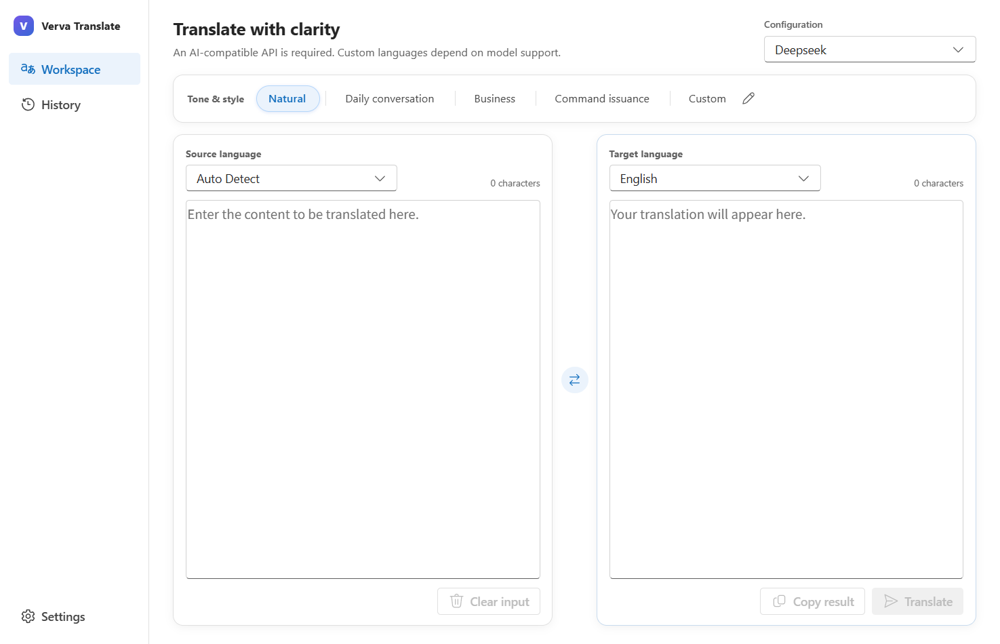
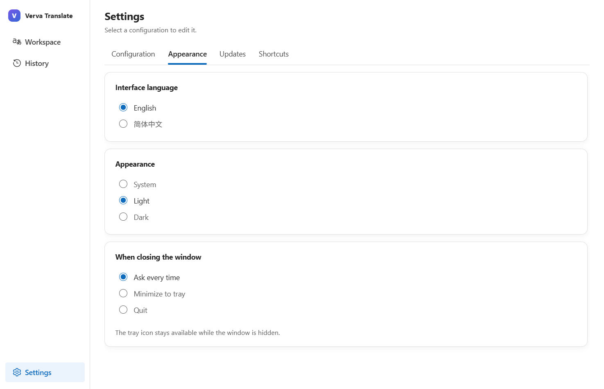

# Verva Translate

**English** · [简体中文](README.zh-CN.md)

> Carry the meaning. Keep the voice.

Verva Translate is a Windows-first, bring-your-own-AI translator. It connects directly to an OpenAI-compatible or Claude-compatible endpoint and lets you control the model, cost, target language, and tone instead of paying for another bundled AI subscription.

I started Verva because I was extremely dissatisfied with machine translation. Too many tools return wording that is technically correct but stiff, context-blind, or unlike anything a person would actually say. Better AI translators often add an expensive monthly fee, while still preventing users from choosing the API and model themselves. Verva exists to return that control to the user.

## Preview

The workspace: tone and style above, each language selector on the pane it applies to.



Settings: configurations are a list; selecting one opens the full editor with a connectivity test.



## Highlights

- OpenAI-compatible and Claude-compatible streaming APIs; no demo engine or bundled model.
- Multiple named configurations with fast switching, encrypted API keys, optional thinking, and optional long conversations.
- Natural, Conversation, Business, Command, and user-authored Custom styles.
- Automatic source-language detection that remains visibly separate from the Auto Detect selector and participates correctly in language swapping.
- Major target languages plus a final Custom option for any language supported by the chosen model.
- Editable streamed results, Stop, visible Copy and bordered Clear actions, and configurable shortcuts.
- Settings and History are in-app pages, not extra windows; English or Simplified Chinese can be selected inside the app.
- A connectivity test for each configuration, so a Base URL, model, and key can be checked before translating.
- Closing the window can minimize to the notification area, quit, or ask each time.
- Stronghold-encrypted local history limited to 100 entries, single-instance behavior, and stable/beta signed updates.
- A conventional bilingual NSIS installer with destination selection and progress, plus a versioned portable executable.

## Download

Download a release from [GitHub Releases](https://github.com/Trilives/verva-translator/releases):

- `Verva-Translate-<version>-windows-x64-setup.exe` — recommended installer. It offers an installation-language selector, optional destination selection, progress UI, shortcuts, and uninstall support.
- `Verva-Translate-<version>-windows-x64-portable.exe` — portable build. It reports available updates but never replaces itself automatically.

Verva requires an AI-compatible API. Custom language support, thinking mode, output quality, and usage cost all depend on the selected provider and model. With short text and current provider pricing, a translation using `deepseek-v4-flash` can cost less than US$0.01; actual cost varies with text length, history, reasoning, caching, and future prices.

## Configure a model

1. Open **Settings** from the left rail.
2. Add a configuration, or select one to expand it.
3. Choose **OpenAI compatible** or **Claude compatible**.
4. Enter its HTTPS Base URL, model name, and API key. Plain HTTP is accepted only for localhost.
5. Optionally enable Thinking mode or Long conversation.
6. Use **Test connection** to confirm the endpoint answers, then **Save**. The row collapses once saved.
7. Return to the workspace and pick the configuration from the header.

Long conversation keeps source/result pairs in memory and repeats the translation requirements on every request. It improves consistency across related rounds but uses more tokens. Verva shows the session start time, provides a refresh action, and warns at 50% of the configured context limit.

## Build from source

Requirements on Windows:

- Node.js 20 or newer
- Rust stable
- Microsoft C++ Build Tools with the Desktop development with C++ workload
- Microsoft Edge WebView2 Runtime

```powershell
npm install
npm run tauri dev
```

Run verification:

```powershell
npm test
npm run build
cargo test --manifest-path src-tauri/Cargo.toml
npm run tauri -- build
```

## Security and local data

- Non-secret preferences use the official Tauri Store plugin.
- API keys and the bounded history use the official Stronghold engine. Its random vault master key is protected for the current Windows account with DPAPI.
- Provider keys are read only by Rust, never placed in ordinary settings or logs.
- App data resolves through Tauri's Windows app-data directory and never depends on this repository path or a developer username.
- Remote model endpoints require HTTPS; only loopback endpoints may use HTTP.
- The official Tauri Updater verifies signed update artifacts. Stable and beta use independent rolling manifests.

Source text is sent to the endpoint you configure. Review that provider's data policy before translating sensitive material.

## Project structure

```text
src/                         React + TypeScript + Fluent UI React v9
  components/                Focused reusable UI pieces
  domain/                    Provider-neutral types and catalogs
  hooks/                     Application interaction state
  i18n/                      English and Simplified Chinese messages
  pages/                     Workspace, History, and Settings pages
  services/                  Typed Tauri/plugin adapters
src-tauri/                   Tauri 2 Rust desktop core
  capabilities/              Per-window least-privilege policy
  src/providers/             OpenAI/Claude streaming adapters
  src/security.rs            DPAPI-protected Stronghold bootstrap
  src/tray.rs                Notification-area icon and menu
docs/                        Architecture and modularization notes
.github/workflows/           Stable/beta Windows release pipeline
```

Read [architecture.md](docs/architecture.md), [modularization.md](docs/modularization.md), and the [product introduction](docs/introduction.md) before making structural changes.

## Release signing

GitHub Actions expects `TAURI_SIGNING_PRIVATE_KEY` and `TAURI_SIGNING_PRIVATE_KEY_PASSWORD` repository secrets. The matching public key is committed in `src-tauri/tauri.conf.json`. The workflow validates stable/beta SemVer, runs tests, builds the portable executable and NSIS installer, creates SHA-256 files, publishes signed updater artifacts, and refreshes the chosen channel manifest.
