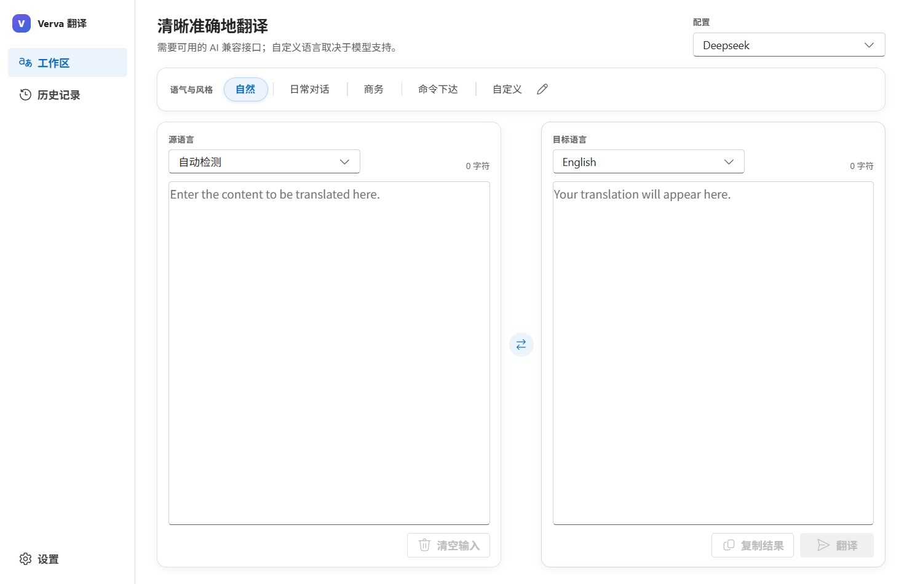
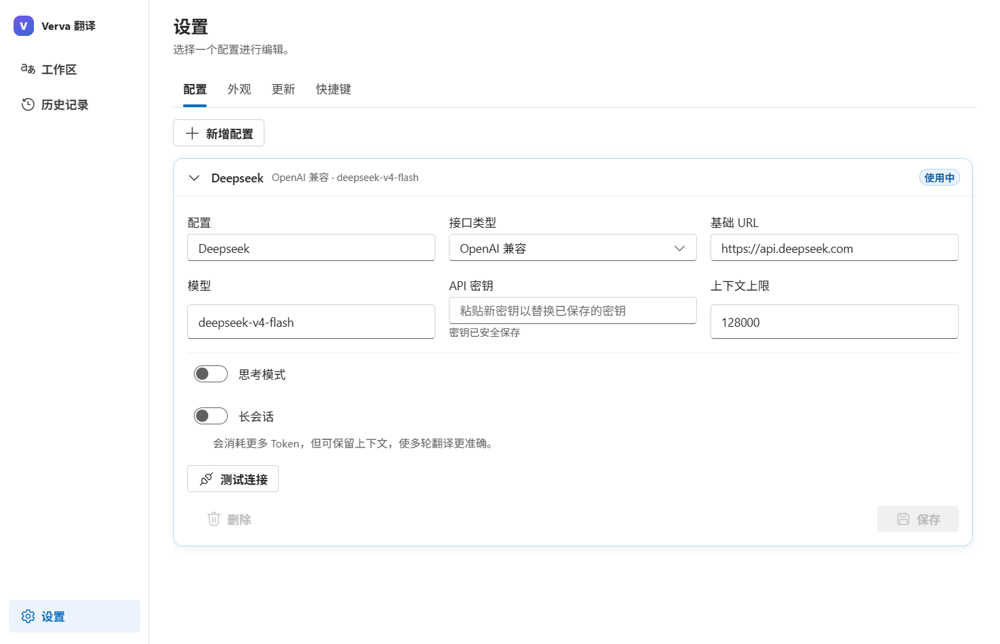

# Verva Translate

[English](README.md) · **简体中文**

> 译出含义，也保留语气。

Verva Translate 是一款面向 Windows 的“自带 AI 接口”翻译工具。它直接连接兼容 OpenAI 或兼容 Claude 的端点，让用户自行决定模型、成本、目标语言和表达风格，而不是再购买一个捆绑 AI 服务的月费订阅。

我开发 Verva，是因为我对机器翻译极其不满。很多译文在字面上没有错，却生硬、忽略上下文，也不像真实的人会说的话。更好的 AI 翻译工具往往需要昂贵的月费，却仍然不允许用户自行选择 API 和模型。Verva 希望把这些选择权交还给用户。

## 界面预览

工作区：语气与风格独立成块置于上方，源语言与目标语言分别位于各自的编辑区。



设置：配置以列表呈现，展开后可编辑全部字段，并可测试连接。



## 主要功能

- 支持兼容 OpenAI 与兼容 Claude 的流式接口；不提供演示引擎，也不捆绑模型。
- 可保存并快速切换多套配置；API 密钥加密保存；每套配置可独立开启思考模式和长会话。
- 提供自然、日常对话、商务、命令下达和用户自定义风格。
- 自动识别源语言，但不会替换“自动检测”选择框；检测结果显示在旁边，并可正确参与语言交换。
- 内置主要目标语言，列表末尾提供“自定义”，可输入模型支持的其他语言。
- 译文支持流式显示和直接编辑；翻译时按钮变为停止；复制和带边框的清空按钮醒目可见；快捷键可配置。
- 设置与历史记录均为应用内页面，不再额外开窗；可在应用内切换英语或简体中文界面。
- 每套配置都可测试连接，翻译前即可确认基础 URL、模型与密钥是否可用。
- 关闭窗口时可最小化到通知区域、直接退出，或每次询问。
- Stronghold 加密的本地历史最多保留 100 条；支持单实例；支持稳定版与测试版签名更新。
- 提供带语言选择、安装位置和进度界面的标准 NSIS 安装程序，也提供带版本号的便携版。

## 下载

请前往 [GitHub Releases](https://github.com/Trilives/verva-translator/releases)：

- `Verva-Translate-<版本>-windows-x64-setup.exe`：推荐使用。安装程序提供语言选择、可选安装位置、进度显示、快捷方式和卸载支持。
- `Verva-Translate-<版本>-windows-x64-portable.exe`：便携版。它只提示更新，不会自动替换自身。

Verva 必须连接可用的 AI 兼容接口。自定义语言、思考模式、译文质量和费用都取决于所选服务与模型。对于短文本，按照当前服务商价格，使用 `deepseek-v4-flash` 翻译一次可能低于 0.01 美元；实际费用会随文本长度、会话历史、推理、缓存和后续价格变化。

## 配置模型

1. 从左侧栏打开**设置**。
2. 新增一套配置，或点击列表中的配置将其展开。
3. 选择**兼容 OpenAI**或**兼容 Claude**。
4. 填写 HTTPS 基础 URL、模型名和 API 密钥。只有 localhost 可以使用 HTTP。
5. 按需开启思考模式或长会话。
6. 点击**测试连接**确认接口可用，然后**保存**；保存后该项会自动收起。
7. 返回工作区，在顶部选择该配置。

长会话会在内存中保留此前的原文与译文，并在每次请求中重复必要要求。它能改善多轮翻译的一致性，但会消耗更多 Token。主界面会显示会话开始时间，提供刷新按钮，并在达到设定上下文的 50% 时提醒。

## 从源代码构建

Windows 开发环境需要：

- Node.js 20 或更高版本
- Rust stable
- Microsoft C++ Build Tools，并安装“使用 C++ 的桌面开发”工作负载
- Microsoft Edge WebView2 Runtime

```powershell
npm install
npm run tauri dev
```

验证命令：

```powershell
npm test
npm run build
cargo test --manifest-path src-tauri/Cargo.toml
npm run tauri -- build
```

## 安全与本地数据

- 非敏感偏好使用官方 Tauri Store 插件。
- API 密钥和有限历史记录使用官方 Stronghold 引擎；随机主密钥再由 Windows DPAPI 绑定到当前账户。
- 只有 Rust 后端可以读取服务商密钥；密钥不会写入普通设置或日志。
- 数据目录由 Tauri 解析到 Windows 应用数据位置，不依赖开发仓库，也不包含硬编码用户名。
- 远程模型必须使用 HTTPS；仅本机回环端点允许 HTTP。
- 官方 Tauri Updater 会验证签名更新；稳定版与测试版使用独立清单。

原文会发送到用户自行配置的端点。翻译敏感内容前，请确认该服务商的数据政策。

## 项目结构与发布

前端位于 `src/`，使用 React、TypeScript 和 Fluent UI React v9；Rust/Tauri 核心位于 `src-tauri/`；架构、文件拆分规则和执行清单位于 `docs/`。

请先阅读 [architecture.md](docs/architecture.md)、[modularization.md](docs/modularization.md) 和[产品介绍](docs/introduction.md)。GitHub Actions 需要配置 `TAURI_SIGNING_PRIVATE_KEY` 与 `TAURI_SIGNING_PRIVATE_KEY_PASSWORD` 仓库密钥，之后即可选择 stable 或 beta 流水线，生成带版本号的便携版、安装程序、哈希文件和签名更新清单。
