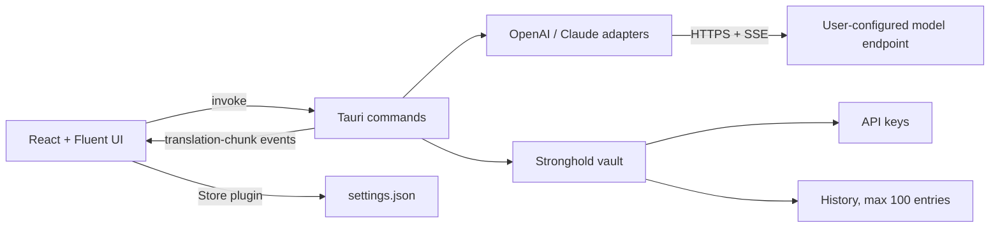

# Verva Translate architecture

This document describes the application as it is built today. Where a rule is an
intention rather than current behaviour, it says so explicitly.

## 1. Decision

Verva Translate is a Windows-first Tauri 2 desktop application.

- Desktop shell and privileged core: Rust + Tauri 2
- UI: React 18 + TypeScript + Vite
- Component system: Fluent UI React v9 and Fluent System Icons
- Network boundary: Rust `reqwest`; the webview never receives an API key
- Local configuration: official Tauri Store plugin
- Secrets and history: official Tauri Stronghold plugin, whose master key is
  wrapped with Windows DPAPI
- Packaging: Tauri NSIS per-user setup plus a versioned portable executable

The old WPF application and bespoke installer were removed during the Tauri
rewrite; they are not compatibility layers.

## 2. Runtime boundaries



React owns presentation state, dialogs, keyboard interaction, and localization.
Rust owns HTTP, secrets, filesystem paths, encryption, update discovery, and
cancellation. Provider payloads and credentials are never assembled in the
webview.

Note that preferences are read and written by the frontend **directly through
the Store plugin**, not through Rust commands. Rust reads the same store when it
needs a profile for a translation.

## 3. Windows and popup model

The application has two Tauri windows:

- `main`: translation workspace, history dialog, and Custom-style editor.
- `settings`: a separate, single-instance settings window created on demand.

Both windows are frameless (`decorations: false`) and draw their own title bar
via `WindowTitleBar`. Auxiliary surfaces are Fluent UI `Dialog` components inside
their owner window: no native window controls, no taskbar entry, an upper-left
title, and bottom actions.

Opening Settings twice focuses the existing settings window. Opening the
application twice focuses and restores the existing main window through the
Tauri single-instance plugin.

### Creating the settings window

`open_settings_window` **must remain an `async` command.** Tauri runs synchronous
commands on the main thread, where `WebviewWindowBuilder::build()` deadlocks on
Windows: the window shell is created but `build()` never returns, so the webview
stays on `about:blank` and the window renders as a blank white surface.

### Fluent portals

Fluent copies `FluentProvider`'s `className` onto the portal mount node it
appends to `<body>` for Dropdown, Tooltip, and Dialog. Any unscoped sizing rule
for that class therefore applies to the portal as well, turning it into a
full-viewport opaque sheet at `z-index: 1000000` that hides the whole window.
Layout rules are scoped to `#root > .provider-root`, and `body > .fui-FluentProvider`
explicitly has its layout neutralised. `src/styles/global.test.ts` guards both.

## 4. Frontend structure

```text
src/
|- main.tsx            root render, window label, error boundary
|- AppShell.tsx        theme + i18n providers, routing by window label
|- pages/              MainPage (workspace), SettingsPage
|- components/         workspace and settings UI, dialogs, title bar
|- hooks/              useAppSettings, useTranslation, useShortcuts
|- services/           Tauri invoke/event wrappers, store, updater
|- domain/             catalogs and shared TypeScript types
|- i18n/               typed English and Chinese dictionaries
`- styles/             global.css
```

The workspace owns source text and editable result, major target languages plus
Custom, the Natural/Conversation/Business/Command/Custom styles, the pencil
action inside the Custom card (selecting the card does not open the editor),
Translate-to-Stop state, coalesced streaming rendering, detected-source display
beside Auto Detect, Swap, Copy, Clear, and configurable shortcuts.

Settings owns profiles, provider interface, base URL, model, secret entry,
thinking mode, long conversation, context limit, updates, shortcuts, and UI
language.

The history dialog shows the latest 100 translations; restored results remain
editable. Long-conversation session state lives in `useTranslation` and is
memory-only.

## 5. Rust core

```text
src-tauri/src/
|- lib.rs              plugin, state, and command registration
|- commands/           thin Tauri command adapters
|- providers/          OpenAI, Claude, SSE, prompt construction
|- state.rs            Stronghold vault, cancellations, sessions, HTTP client
|- security.rs         DPAPI protect/unprotect and master-key bootstrap
|- history.rs          bounded history stored in the vault
`- models.rs           shared serde types
```

Registered commands:

- `open_settings_window`, `close_settings_window`
- `save_api_key`, `has_api_key`, `delete_api_key`
- `start_translation`, `cancel_translation`
- `list_history`, `clear_history`
- `install_mode`
- `check_update`

Commands delegate immediately to modules. Command modules do not contain
provider parsing, filesystem policy, or UI strings.

### Translation streaming

`start_translation` loads the profile from the Store, reads the API key from the
vault into a `Zeroizing<String>`, registers a cancellation flag under the
frontend-supplied request ID, and spawns one provider adapter. Adapters share a
provider-neutral `StreamRequest` and support:

- OpenAI-compatible `POST /chat/completions`
- Claude-compatible `POST /v1/messages`
- SSE streaming with ordinary JSON fallback
- thinking-mode fields only when enabled

The model is instructed to emit `[[LANGUAGE:name]]` on the first line;
`ProtocolDecoder` strips that marker and reports the detected language.

Rust emits a single `translation-chunk` event carrying the request ID, text,
detected language, token estimate, and `done`/`error` flags. React ignores events
for stale IDs and renders at most once per animation frame. Stop sets the
cancellation flag and preserves the partial editable result.

### Long conversation

Each profile can enable a memory-only session held in `AppState.sessions`. Every
request includes prior turns and repeats target-language, style, and custom
requirements. A character-to-token estimate (`len / 4`) drives the 50% warning,
and the oldest turns are dropped past 90% of the context limit. Switching
profiles or pressing Refresh starts a new session.

## 6. Persistence and security

All runtime data lives under Tauri's `app_local_data_dir()`. No runtime path
references the repository, build output, or the current working directory.

- `settings.json`: Store data containing profiles without API keys, shortcuts,
  UI language, theme, and update channel
- `secrets.hold`: Stronghold vault containing API keys **and** the bounded
  history (`history-v1`)
- `stronghold-master.dpapi`: random 32-byte master key protected for the current
  Windows account

API keys use Stronghold records keyed by stable profile UUIDs
(`provider-key:<uuid>`). Keys never enter Store JSON, frontend state, or history.
Deleting a profile also deletes its Stronghold record.

Remote model URLs require HTTPS; plain HTTP is allowed only for `localhost`,
`127.0.0.1`, and `::1`.

Tauri capabilities are split by window; the frontend receives only the core
window/event, store, updater, and process permissions it uses. Shell and
unrestricted filesystem plugins are not exposed. The content-security policy
permits only the Tauri origin and local assets.

**Known gaps.** Provider error bodies are not size-limited, responses are not
bounded, and there is no explicit request timeout or redirect bound. Errors are
returned as plain strings and are not systematically secret-redacted. These are
intended, not implemented.

## 7. Preferences and profiles

Profiles have stable UUIDs and contain name, provider kind, base URL, model,
thinking flag, long-conversation flag, and context limit. The active profile ID
is stored separately.

## 8. Localization

English is the primary source language; Simplified Chinese is the reference
translation. Both dictionaries are typed from the English one, and
`messages.test.ts` enforces key parity. UI language switches in Settings.

Installer localization is handled by Tauri NSIS with English and Simplified
Chinese and `displayLanguageSelector: true`.

The empty editor prompts are deliberately English in both UI modes:

- `Enter the content to be translated here.`
- `Your translation will appear here.`

## 9. Installation and updates

The release workflow produces:

- `Verva-Translate-<version>-windows-x64-portable.exe`
- `Verva-Translate-<version>-windows-x64-setup.exe` and its `.sig`
- SHA-256 files for both

NSIS installs per-user without elevation and provides a language dropdown,
destination selection, Start Menu shortcut, and uninstall registration.

`install_mode` reports `installed` when a `.verva-installed` marker written by
the NSIS hook sits beside the executable, and `portable` otherwise. Only
installed copies download and apply an update; portable copies report an
available version only. Stable and Beta use independent rolling signed manifests
published to `updater-stable` / `updater-beta` tags.

Updater artifacts require `TAURI_SIGNING_PRIVATE_KEY` and
`TAURI_SIGNING_PRIVATE_KEY_PASSWORD`; the workflow fails early when the signing
key is absent, and fails the build if Tauri does not emit a signed NSIS artifact.

## 10. Release pipeline

`\.github/workflows/release.yml` is a manual `workflow_dispatch` job that:

1. validates the SemVer input against the chosen channel and checks signing
   configuration;
2. installs Node and Rust dependencies from lockfiles;
3. applies the version to `package.json`, `Cargo.toml`, and a generated
   `tauri.release.conf.json` that enables updater artifacts;
4. runs `npm ci`, `npm test`, `cargo test`, and the Tauri build;
5. stages versioned artifacts with SHA-256 files and verifies the signature
   exists;
6. publishes the version release (prerelease for Beta, latest for stable) and
   replaces the rolling updater manifest.

The workflow does not currently run ESLint, `cargo fmt --check`, or
`cargo clippy`; those are local checks. Adding them is intended.

## 11. Testing boundaries

Current automated coverage is deliberately small:

- `src/domain/catalogs.test.ts`: language and style catalogue invariants
- `src/i18n/messages.test.ts`: English/Chinese key parity and fixed placeholders
- `src/styles/global.test.ts`: Fluent portal layout regression guard
- `src-tauri`: one unit test covering the endpoint HTTPS/loopback policy

**Not yet covered**, though described as goals: React behaviour tests, streaming
coalescing, session threshold, provider payload and SSE parsing tests, command
serialization, and release smoke checks.

No test may call a paid model endpoint.
