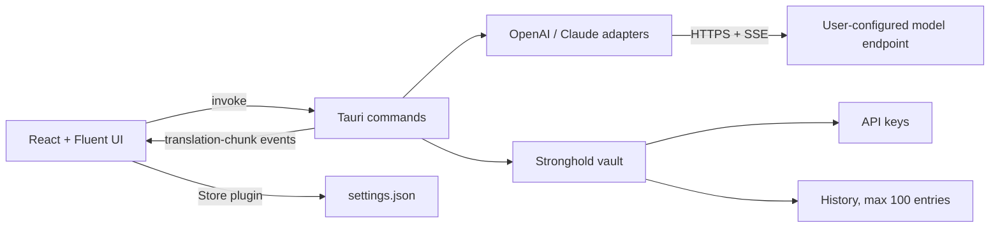

# Verva Translate architecture

This document describes the application as it is built today. Where a rule is an
intention rather than current behaviour, it says so explicitly.

## 1. Decision

Verva Translate is a Windows-first Tauri 2 desktop application.

- Desktop shell and privileged core: Rust + Tauri 2
- UI: React 18 + TypeScript + Vite
- Component system: Fluent UI React v9 and Fluent System Icons
- Network boundary: Rust `reqwest`; the webview never receives an API key
- Local configuration: official Tauri Store plugin
- Secrets and history: official Tauri Stronghold plugin, whose master key is
  wrapped with Windows DPAPI
- Packaging: Tauri NSIS per-user setup plus a versioned portable executable

The old WPF application and bespoke installer were removed during the Tauri
rewrite; they are not compatibility layers.

## 2. Runtime boundaries



React owns presentation state, dialogs, keyboard interaction, and localization.
Rust owns HTTP, secrets, filesystem paths, encryption, update discovery, and
cancellation. Provider payloads and credentials are never assembled in the
webview.

Note that preferences are read and written by the frontend **directly through
the Store plugin**, not through Rust commands. Rust reads the same store when it
needs a profile for a translation.

## 3. Window and page model

The application has exactly one Tauri window, `main`, with **native decorations**
and a Mica backdrop (`transparent: true` plus `windowEffects`). There is no
hand-drawn title bar and no second OS window.

Workspace, History, and Settings are in-app pages selected from the sidebar.
Only Custom style, Update, and the close prompt are Fluent `Dialog` surfaces.

This replaced an earlier design with a separate `settings` window, which shipped
two blank-window defects: a frameless second window whose builder deadlocked on
the main thread, and a Fluent portal that covered the workspace. A single window
with native chrome removes both classes of failure. **Do not reintroduce a second
window without re-reading §11.**

Launching the application twice restores and focuses the existing window through
the single-instance plugin, which calls the same `tray::show_main` used by the
tray icon.

### Narrow and short windows

The window minimum is 560x420. Shrinking must never leave a block clipped and
unreachable, and the input and output panes are what the page is for, so they
give up room last:

- the stylesheet sets no `min-width` floor on `html`/`body`; the earlier 880px
  floor clipped the right-hand side with no way to scroll to it;
- the tone row never wraps, it scrolls sideways, so its height is constant;
- below 640px of height the header subtitle is dropped, the title and padding
  shrink, and the profile caption and session-chip timestamp are hidden, which
  moves the panes up by roughly 140px;
- the panes keep a small floor (216px, with 88px editors) rather than the
  earlier 320px/200px, so they stay visible far longer;
- only once that floor no longer fits does `.workspace` scroll.

Elements hidden at small sizes are decorative or carry an `aria-label` already;
the session chip is compacted rather than hidden because it is the only readout
of context usage.

### Closing and the tray

A tray icon is registered at startup. `WindowEvent::CloseRequested` on `main` is
intercepted and resolved against `closeBehavior` read from the store:

- `exit`: the close proceeds and the process ends.
- `tray`: the close is prevented and the window is hidden.
- `ask` (default): the close is prevented and `close-requested` is emitted, so
  the UI can offer Minimize to tray / Quit, optionally remembering the choice.

The webview holds no `core:window` permissions; hiding and quitting go through
the `hide_to_tray` and `quit_app` commands.

### Fluent portals

Fluent copies `FluentProvider`'s `className` onto the portal mount node it
appends to `<body>` for Dropdown, Tooltip, and Dialog. Any unscoped sizing rule
for that class therefore applies to the portal as well, turning it into a
full-viewport opaque sheet at `z-index: 1000000` that hides the whole window.
Layout rules are scoped to `#root > .provider-root`, and `body > .fui-FluentProvider`
explicitly has its layout neutralised. `src/styles/stylesheets.test.ts` guards
both across every sheet, not just one.

Fluent's `DialogBody` is a grid that hands `DialogActions` a single narrow
column. A third action therefore makes all three buttons shrink to the same
width and the longest label wraps onto a second line, which is what happened to
Minimize to tray in the close prompt. The dialogs that carry three actions give
the row the full body width and let each button keep its natural size.

## 4. Frontend structure

```text
src/
|- main.tsx            root render, stylesheet import order, error boundary
|- AppShell.tsx        theme + i18n providers, page routing, workspace state
|- pages/              MainPage (workspace), HistoryPage, SettingsPage
|- components/         workspace and settings UI, dialogs
|- hooks/              useAppSettings, useWorkspace, useTranslation, useShortcuts
|- services/           Tauri invoke/event wrappers, store, updater
|- domain/             catalogs and shared TypeScript types
|- i18n/               typed English and Chinese dictionaries
`- styles/             base, workspace, dialogs, settings, history, responsive
```

The workspace owns source text and editable result, major target languages plus
Custom, the tone row, streaming state, coalesced streaming rendering,
detected-source display beside Auto Detect, Swap, Copy, Clear, and configurable
shortcuts.

Translate is a single-purpose button on the input pane and is disabled while a
translation streams; the translate shortcut is guarded the same way, since a
restart would discard the partial result. Stop is rendered on the result pane
only while streaming.

Source text and translation state live in `useWorkspace`, called by `AppShell`
rather than by `MainPage`. Selecting History or Settings unmounts the workspace
page, so state owned by the page was discarded: a half-typed input vanished on
every navigation. The hook is memory-only and nothing it holds reaches
`settings.json`.

### Tone and style

Four builtin tones (Natural, Daily conversation, Business, Command issuance) are
followed by up to four user-defined tones and then an Add button, which is
hidden once the fourth exists. A user-defined tone carries a name and free-text
requirements and is edited through the pencil on its own bubble; selecting a
bubble never opens the editor.

Rust is unchanged by this: a builtin sends its key as `style` with an empty
`customStyle`, and a user-defined tone sends its name as `style` and its
requirements as `customStyle`.

The earlier design had a single fixed Custom card backed by one free-text field.
`migrateUiState` promotes that text to a named tone on first load and writes the
result back immediately, because a promoted tone is minted with a fresh UUID and
would otherwise be re-minted on every launch. A selection naming a tone that no
longer exists falls back to the first builtin.

Settings owns profiles, provider interface, base URL, model, secret entry,
thinking mode, long conversation, context limit, updates, shortcuts, and UI
language.

The history dialog shows the latest 100 translations; restored results remain
editable. Long-conversation session state lives in `useTranslation` and is
memory-only.

## 5. Rust core

```text
src-tauri/src/
|- lib.rs              plugin, state, and command registration
|- commands/           thin Tauri command adapters
|- providers/          OpenAI, Claude, SSE, prompt construction
|- state.rs            Stronghold vault, cancellations, sessions, HTTP client
|- security.rs         DPAPI protect/unprotect and master-key bootstrap
|- history.rs          bounded history stored in the vault
`- models.rs           shared serde types
```

Registered commands:

- `save_api_key`, `has_api_key`, `delete_api_key`
- `start_translation`, `cancel_translation`
- `test_profile`
- `list_history`, `clear_history`
- `install_mode`
- `check_update`
- `hide_to_tray`, `quit_app`

`test_profile` sends one `max_tokens: 1` request to the configured endpoint and
returns reachability plus latency. Its error text passes through
`providers::redact`, which strips the active key and caps the message length.

Commands delegate immediately to modules. Command modules do not contain
provider parsing, filesystem policy, or UI strings.

### Translation streaming

`start_translation` loads the profile from the Store, reads the API key from the
vault into a `Zeroizing<String>`, registers a cancellation flag under the
frontend-supplied request ID, and spawns one provider adapter. Adapters share a
provider-neutral `StreamRequest` and support:

- OpenAI-compatible `POST /chat/completions`
- Claude-compatible `POST /v1/messages`
- SSE streaming with ordinary JSON fallback
- thinking-mode fields only when enabled

The model is instructed to emit `[[LANGUAGE:name]]` on the first line;
`ProtocolDecoder` strips that marker and reports the detected language.

Rust emits a single `translation-chunk` event carrying the request ID, text,
detected language, token estimate, and `done`/`error` flags. React ignores events
for stale IDs and renders at most once per animation frame. Stop sets the
cancellation flag and preserves the partial editable result.

### Long conversation

Each profile can enable a memory-only session held in `AppState.sessions`. Every
request includes prior turns and repeats target-language, style, and custom
requirements. A character-to-token estimate (`len / 4`) drives the 50% warning,
and the oldest turns are dropped past 90% of the context limit. Switching
profiles or pressing Refresh starts a new session.

## 6. Persistence and security

All runtime data lives under Tauri's `app_local_data_dir()`. No runtime path
references the repository, build output, or the current working directory.

- `settings.json`: Store data containing profiles without API keys, shortcuts,
  UI language, theme, and update channel
- `secrets.hold`: Stronghold vault containing API keys **and** the bounded
  history (`history-v1`)
- `stronghold-master.dpapi`: random 32-byte master key protected for the current
  Windows account

API keys use Stronghold records keyed by stable profile UUIDs
(`provider-key:<uuid>`). Keys never enter Store JSON, frontend state, or history.
Deleting a profile also deletes its Stronghold record.

Remote model URLs require HTTPS; plain HTTP is allowed only for `localhost`,
`127.0.0.1`, and `::1`.

Tauri capabilities are split by window; the frontend receives only the core
window/event, store, updater, and process permissions it uses. Shell and
unrestricted filesystem plugins are not exposed. The content-security policy
permits only the Tauri origin and local assets.

Interface state (page, languages, selected tone, user-defined tones, settings
tab) is stored under a separate `ui-state` key so the window looks the same on
the next launch. It must never gain a field carrying source text or a
translation result: `settings.json` is plain JSON, and translation content
belongs in the vault. `src/services/uiState.test.ts` enforces this.

User-defined tone names and requirements are user-authored instructions rather
than translated content, so they belong in this file; the source text and the
result do not, and stay in `useWorkspace` in memory.

**Known gaps.** Streaming responses are not size-bounded and the streaming path
has no explicit request timeout or redirect bound; only `test_profile` sets a
timeout. Redaction is applied to connectivity-test failures but not yet to every
streaming error path. These are intended, not implemented.

## 7. Preferences and profiles

Profiles have stable UUIDs and contain name, provider kind, base URL, model,
thinking flag, long-conversation flag, and context limit. The active profile ID
is stored separately.

## 8. Localization

English is the primary source language; Simplified Chinese is the reference
translation. Both dictionaries are typed from the English one, and
`messages.test.ts` enforces key parity. UI language switches in Settings.

Language names are a second pair of sets in `i18n/languages.ts`, keyed by the
catalogue identifier, with `languages.test.ts` enforcing that both locales cover
every catalogue entry.

The catalogue entries in `domain/catalogs.ts` are **identifiers, not labels**.
They are stored in `ui-state`, written to history, and interpolated into the
prompt, so they stay English in every locale; only the label localizes.
`LanguageSelect` renders `language(option)` but passes `optionValue` back
unchanged, and `languageLabel` returns unknown values as-is because the detected
language comes from the model and need not be in the catalogue. Translating an
identifier would change what reaches the model and orphan existing history.

Installer localization is handled by Tauri NSIS with English and Simplified
Chinese and `displayLanguageSelector: true`.

The empty editor prompts follow the interface language like every other string.
They were previously pinned to English in both modes; that is no longer the
case, and `messages.test.ts` now asserts the opposite -- that they are actually
translated rather than copied across. The only strings legitimately identical in
both dictionaries are the interface-language endonyms, since the switcher shows
each language in its own script either way.

## 9. Installation and updates

The release workflow produces:

- `Verva-Translate-<version>-windows-x64-portable.exe`
- `Verva-Translate-<version>-windows-x64-setup.exe` and its `.sig`
- SHA-256 files for both

NSIS installs per-user without elevation and provides a language dropdown,
destination selection, Start Menu shortcut, and uninstall registration.

`install_mode` reports `installed` when a `.verva-installed` marker written by
the NSIS hook sits beside the executable, and `portable` otherwise. Only
installed copies download and apply an update; portable copies report an
available version only.

The directory is resolved with `std::env::current_exe()`. It must not use
`PathResolver::executable_dir()`, which is the XDG "user's executables"
location and resolves to nothing on Windows: it never found the marker, so
every installed build reported itself portable and refused to self-update.
`commands::updates::tests` covers the resolution. Stable and Beta use independent rolling signed manifests
published to `updater-stable` / `updater-beta` tags.

Updater artifacts require `TAURI_SIGNING_PRIVATE_KEY` and
`TAURI_SIGNING_PRIVATE_KEY_PASSWORD`; the workflow fails early when the signing
key is absent, and fails the build if Tauri does not emit a signed NSIS artifact.

## 10. Release pipeline

`\.github/workflows/release.yml` is a manual `workflow_dispatch` job that:

1. validates the SemVer input against the chosen channel and checks signing
   configuration;
2. installs Node and Rust dependencies from lockfiles;
3. applies the version to `package.json`, `Cargo.toml`, and a generated
   `tauri.release.conf.json` that enables updater artifacts;
4. runs `npm ci`, `npm test`, `cargo test`, and the Tauri build;
5. stages versioned artifacts with SHA-256 files and verifies the signature
   exists;
6. publishes the version release (prerelease for Beta, latest for stable) and
   replaces the rolling updater manifest.

The workflow does not currently run ESLint, `cargo fmt --check`, or
`cargo clippy`; those are local checks. Adding them is intended.

## 11. Testing boundaries

Current automated coverage is deliberately small:

- `src/domain/catalogs.test.ts`: language and tone catalogue invariants
- `src/i18n/messages.test.ts`: English/Chinese key parity and fixed placeholders
- `src/styles/stylesheets.test.ts`: Fluent portal layout regression guard,
  plus the stylesheet composition rules in §4
- `src/services/uiState.test.ts`: persisted shape and the tone migration
- `src-tauri`: endpoint HTTPS/loopback policy, secret redaction, and the
  install-directory resolution behind `install_mode`

**Not yet covered**, though described as goals: React behaviour tests, streaming
coalescing, session threshold, provider payload and SSE parsing tests, command
serialization, and release smoke checks.

No test may call a paid model endpoint.
