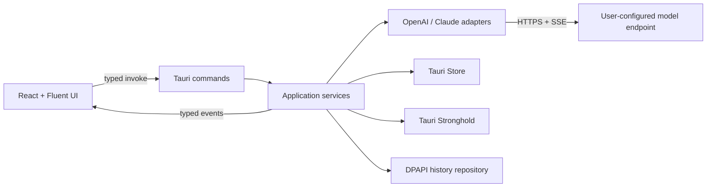

# Verva Translate architecture

## 1. Decision

Verva Translate is a Windows-first Tauri 2 desktop application.

- Desktop shell and privileged core: Rust + Tauri 2
- UI: React 18 + TypeScript + Vite
- Component system: Fluent UI React v9 and Fluent System Icons
- Network boundary: Rust `reqwest`; the webview never receives an API key
- Local configuration: official Tauri Store plugin below the application-data directory
- Secrets: official Tauri Stronghold plugin; its random vault key is wrapped with Windows DPAPI
- History: at most 100 entries, serialized and protected with Windows DPAPI
- Packaging: Tauri NSIS per-user setup plus a versioned portable executable

The old WPF application and bespoke installer are not compatibility layers. They are removed.

## 2. Runtime boundaries

React owns presentation state, dialogs, keyboard interaction, and localization. Rust owns HTTP, secrets, filesystem paths, encryption, update discovery, and cancellation. Provider payloads and credentials must never be assembled in the webview.

## 3. Windows and popup model

The application has two Tauri windows:

- `main`: translation workspace, history dialog, and Custom-style editor.
- `settings`: a separate, single-instance settings window created on demand.

Both windows use an app-drawn title region. Auxiliary surfaces are Fluent UI `Dialog` components inside their owner window: no native minimize, maximize, or close row, no taskbar entry, an upper-left title, and bottom actions. Settings is a separate frameless Tauri window because model configuration is a substantial workflow.

Opening Settings twice focuses the existing settings window. Opening the application twice focuses and restores the existing main window through the Tauri single-instance plugin.

## 4. Frontend structure

`src/app` composes providers, routing by Tauri window label, global error handling, and startup hydration.

`src/features/translate` owns:

- source text and editable result
- major target languages plus Custom
- Natural, Conversation, Business, Command, and Custom styles
- the pencil action inside the Custom card; selecting the card does not open the editor
- Translate-to-Stop state and coalesced streaming rendering
- detected-source display beside Auto Detect
- temporary detected language used by Swap without replacing Auto Detect after translation
- Copy and Clear actions and configurable shortcuts

`src/features/settings` owns profiles, provider interface, base URL, model, secret entry, thinking mode, long conversation, context limit, updates, shortcuts, and UI language.

`src/features/history` owns the Fluent dialog for the latest 100 translations. Results restored from history remain editable.

`src/features/session` owns the in-memory long-conversation session, start time, refresh, repeated requirements, and the 50% context warning. Session messages never persist to disk.

## 5. Rust core

Tauri commands are intentionally coarse and typed:

- `load_preferences`, `save_preferences`
- `read_secret`, `write_secret`, `delete_secret`
- `start_translation`, `cancel_translation`
- `test_profile`
- `load_history`, `append_history`, `clear_history`
- `installation_kind`
- `check_for_update`

Commands delegate immediately to services. Command modules do not contain provider parsing, filesystem policy, or UI strings.

### Translation streaming

`start_translation` validates the profile, builds provider-neutral instructions, registers a cancellation token under a generated request ID, and starts one provider adapter. Adapters support:

- OpenAI-compatible `POST /chat/completions`
- Claude-compatible `POST /messages`
- SSE streaming with ordinary JSON fallback
- a structured final object containing `translation`, `source_language_code`, and `source_language`
- bounded response size and timeout
- thinking-mode fields only when enabled

Rust emits `translation://chunk`, `translation://completed`, and `translation://failed` payloads containing the request ID. React ignores events for stale IDs and renders at most once per animation frame. Stop cancels the Rust request and preserves the partial editable result.

### Long conversation

Each profile can enable a memory-only session. Every request includes prior source/result turns and repeats target-language, style, and custom requirements. A deterministic character-to-token estimate drives the 50% warning. Switching profiles or pressing Refresh starts a new session.

## 6. Persistence and security

All non-secret runtime data uses `app_data_dir()/VervaTranslate` resolved by Tauri. No runtime path may reference the repository, build output, a username, or the current working directory.

- `settings.json`: Tauri Store data containing profiles without API keys, shortcuts, UI language, and update channel
- `secrets.hold`: Stronghold vault containing API keys and at most 100 history entries
- `stronghold-master.dpapi`: random Stronghold master key protected for the current Windows account

API keys use Tauri Stronghold records derived from stable profile UUIDs. A cryptographically random Stronghold vault password is generated once and stored only as a Windows DPAPI-wrapped blob. Keys never enter Store JSON, logs, frontend state hydration, command errors, release diagnostics, or history.

Remote model URLs require HTTPS. Plain HTTP is allowed only for loopback hosts. Redirects are bounded. Error bodies are size-limited and the active key is redacted before returning an error.

Tauri capabilities are split by window. The frontend receives only the core window/event permissions and updater/process permissions it actually uses. Shell and unrestricted filesystem plugins are not exposed.

The content-security policy permits only the Tauri origin and local assets; provider network access occurs in Rust.

## 7. Preferences and profiles

Profiles have stable UUIDs and contain provider, base URL, model, thinking flag, long-conversation flag, and context limit. The active profile ID is stored separately. Deleting a profile also deletes its Stronghold API-key record.

## 8. Localization

English is the primary source language. Simplified Chinese is the reference translation. UI language switches in Settings and updates both windows without clearing editor text, result text, selections, session state, or unsaved profile fields.

Installer localization is handled by Tauri NSIS with English and Simplified Chinese and `displayLanguageSelector: true`.

The empty editor prompts are deliberately English in both UI modes:

- `Enter the content to be translated here.`
- `Your translation will appear here.`

## 9. Installation and updates

Tauri produces:

- `Verva-Translate-<version>-windows-x64-portable.exe` portable executable
- `Verva-Translate-<version>-windows-x64-setup.exe` NSIS installer
- SHA-256 files for both

NSIS provides a conventional window, language dropdown, optional destination selection, file-copy progress, Start Menu shortcut, and uninstall registration. The default installation is per-user and does not require elevation.

Installed copies may use Tauri's signed updater after confirmation. A marker written by the NSIS hook identifies installed copies even when the user chooses a custom destination. Portable copies only report an available version. Stable and Beta use independent signed rolling manifests. Automatic checks are optional; manual checks always remain available.

Updater artifacts require `TAURI_SIGNING_PRIVATE_KEY` and `TAURI_SIGNING_PRIVATE_KEY_PASSWORD` in GitHub Actions. A release must not claim self-update support when signatures were not produced.

## 10. Release pipeline

The Windows GitHub Actions job must:

1. validate stable/Beta SemVer input;
2. install Node and Rust dependencies from lockfiles;
3. run TypeScript lint, unit tests, and production build;
4. run Rust format, Clippy with warnings denied, and Rust tests;
5. build Tauri NSIS bundles with updater signatures;
6. smoke-check expected versioned assets;
7. publish checksums and signed updater metadata;
8. create a prerelease for Beta or mark stable as latest.

Tags are created only after all validation and packaging steps succeed.

## 11. Testing boundaries

- TypeScript unit tests: reducers, localization parity, swap logic, streaming coalescing, session threshold, profile validation.
- React tests: Custom pencil behavior, dialog controls, editable result, Stop state, detected-language label.
- Rust unit tests: prompt construction, URL policy, OpenAI/Claude payloads and SSE parsing, version ordering, path policy, history truncation.
- Integration tests: Tauri command serialization and provider mock server.
- Release smoke checks: portable executable, NSIS installer, signatures, hashes, and updater JSON.

No test may call a paid model endpoint.
